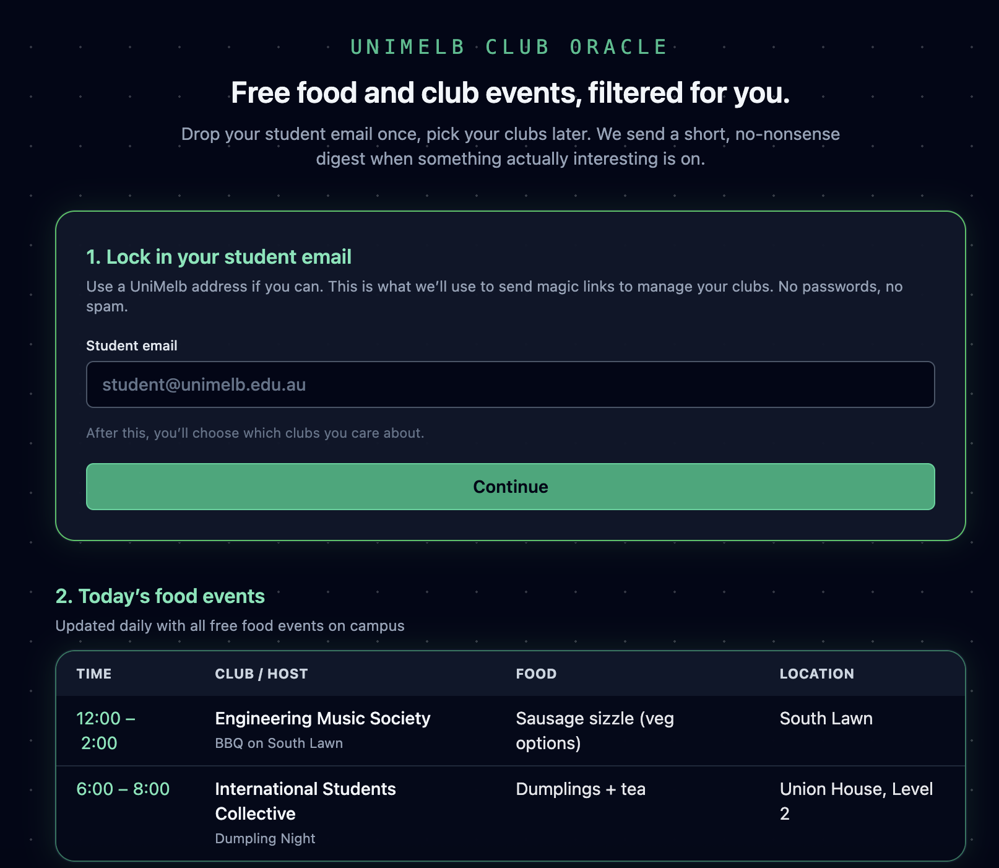
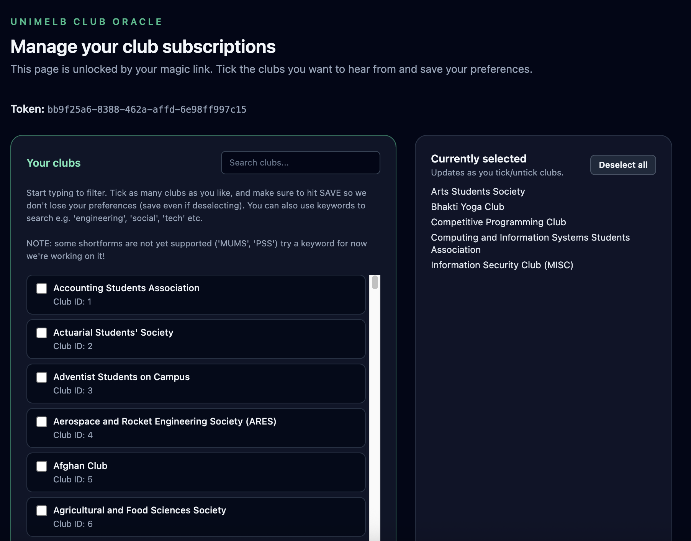

# 🔮 UniMelb Club Oracle (Working Title)

> **A small student project to make club events easier to track.**

I'm building this because a lot of information regarding events is mostly on instagram - which has a bad wrap for mental health and drawing a lot of time. Also saves the search of going through all your clubs to find info sending it straight to your inbox.

I recommend combining with "Beeper" app for insta messaging so you don't have to use instagram if you don't want to (while retaining all the benefits).

---

## 🖼️ Visual Preview

<table>
  <tr>
    <!-- Teaching note: <td> elements create columns in each table row. We'll place two images in adjacent cells. -->
    <td>
      <!-- Teaching note: Replace 'path/to/desktop.png' and alt text with your own screenshot filepath and description -->
      
    </td>
    <td>
      
    </td>
  </tr>
  <tr>
    <!-- Teaching note: Text captions for each image to make the preview accessible and clear. -->
    <td align="center"><em>Desktop dashboard (dark, minimal retro UI)</em></td>
    <td align="center"><em>Club Preference Page</em></td>
  </tr>
</table>

---

## 🍕 1. Today's Food Events

*Updated daily at 8:00 AM*

This table pulls from the `food_events` database which is extracted and classified by gemini when parsing through the raw post data.


| Time             | Club / Host                                            | Food                         | Location             |
| ---------------- | ------------------------------------------------------ | ---------------------------- | -------------------- |
| **12:00 – 2:00** | **Engineering Music Society** *BBQ on South Lawn*      | Sausage sizzle (veg options) | South Lawn           |
| **6:00 – 8:00**  | **International Students Collective** *Dumpling Night* | Dumplings + tea              | Union House, Level 2 |


---

## 🤖 2. The Digest Engine

Most of this is in etl/ - The model takes messy club posts and turns them into structured data.  
That data powers the email digest so people only get updates for clubs they picked.

Below is a sample made on a GEMINI-Flash-2.5-lite I configured (using a scratchpad feature so that it effectively thinks before it's json response - without having to pay for a thinking model)

**Example Model Output (JSON):**

```json
{
  "club_id": "146",
  "display_header": {
    "name": "MUMS",
    "food_tag": "🟢 FREE FOOD WEDNESDAY"
  },
  "main_event": "Competition Maths Catch-up",
  "summary_text": "MUMS has announced a Competition Maths Catch-up on Wednesday, March 18th at 5:30 PM in Room 215, Peter Hall, which will include free pizza. Following this, a Womxn in Maths Coffee Catch-up is scheduled for Thursday, March 19th, from 1:30 PM to 2:30 PM at Castro's Kiosk, offering free coffee and card games.",
  "links": [
    {
      "label": "Register: Competition Maths Catch-up",
      "url": "https://www.instagram.com/p/DV3HCcYk0Tc/"
    },
    {
      "label": "Register: Womxn in Maths Coffee Catch-up",
      "url": "https://www.instagram.com/p/DV3HCcYk0Tc/"
    }
  ]
}
```

---

## 🛠️ Tech Stack & Security

Tools used so Far - it's been the biggest blast learning about these.

Note all the html and css was ai generated - I don't understand front end as much as back end and I believed there are enough websites online to accurately generate a simple html page. Worked well, combed through it no glaring errors I could find. Have learnt a lot and can write a bit - will dedicate more time to development of front end when I launch.

- **Backend:** FastAPI
- **Styling:** Tailwind CSS (Slate-950 Palette)
- **Intelligence:** Gemini-powered ETL (Extract, Transform, Load)
- **Privacy:** Emails are stored **hashed + encrypted** (SHA256 + Fernet). No plain-text student data on disk. 
- **SMTP Config** Using resend free tier (will upgrade to Amazon SES using AWS account)
- **Security:** Input fuzzing and Cloudflare are still on my to-do list.
- **Instagram API interaction:** Instaloader API Python
- **UMSU Website Information:** Used beautiful soup 4 (bs4) to extract all information from their online website to build the foreground of the db backend

---

## 🚧 Roadmap (WIP)

Still building this bit by bit when I have time. I planned a march launch but in the hopes of moderating the product and understanding the code so it doesn't become just another student ai slop project has required a lot of time.

- **Name:** Pick a final name.
- **Pipeline:** Make 8 AM updates fully reliable.
- **Email ETL:** Polish the digest delivery flow.
- **Audit:** Do one final security pass.
- **Hosting:** Get a domain and deploy properly.
- **Gemini Reference Memory:** Keep improving extraction quality.
- **Launchd for Email:** send out emails every 3 days.
- **Res Proxy Config:** Move to using static res proxy.

---

## 🔒 A Note on Privacy

Built by a student, for students. I don't want your passwords, and I don't want your data. I just want this to be useful and to see more people outgoing at random events - a more social unimelb benefits everyone bar none.

**Built with ❤️ at UniMelb.**