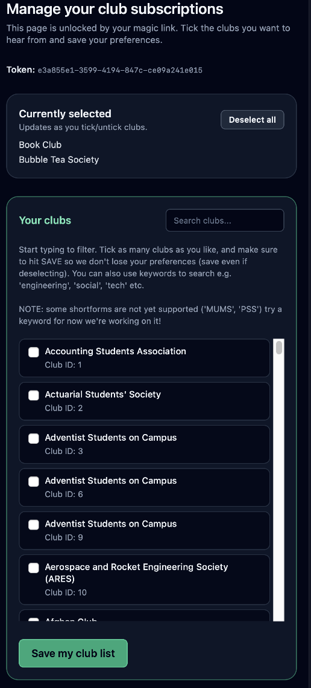
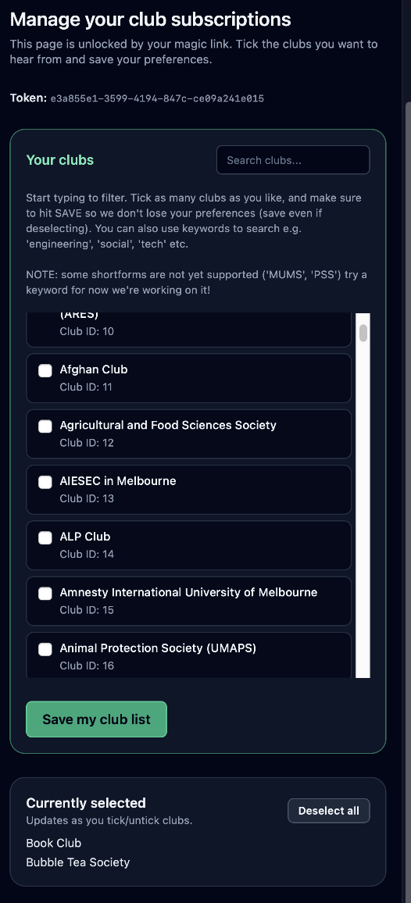

<h2>manage.hmtl</h2>
if you wanna change the ordering of the two pannels search for "order-" in the manage and change them around from 1 to 2
NOTE: maybe get new onboard to implement it as a toggle button for devs

| Reference image 1                                    | Reference image 2                                    |
|------------------------------------------------------|------------------------------------------------------|
|       |       |
